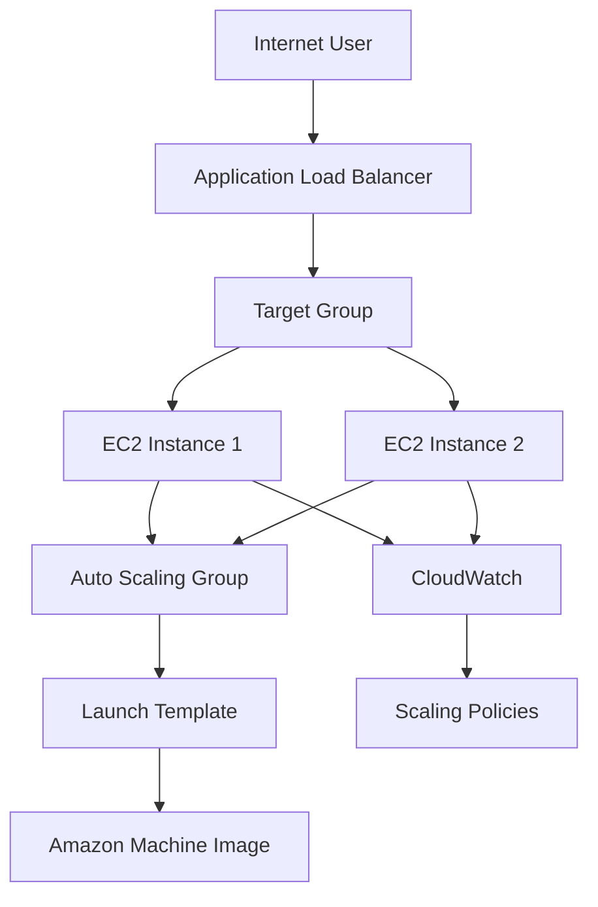

## 🚀 AWS Load Balancer & Auto Scaling Group | High Availability on AWS

Designed and deployed a production-style AWS architecture demonstrating High Availability, Fault Tolerance, and Auto Scaling using Amazon EC2, Application Load Balancer (ALB), Auto Scaling Group (ASG), Target Groups, Launch Templates, and Amazon CloudWatch. The solution automatically distributes incoming traffic, monitors application health, replaces unhealthy instances, and dynamically scales infrastructure based on CPU utilization.


## 📑 Table of Contents

  - [Project Overview](#-project-overview)
  - [Problem Statement](#-problem-statement)
  - [Solution Overview](#️-solution-overview)
  - [Architecture Diagram](#️-architecture-diagram)
    - [ASCII Diagram](#ascii-diagram)
    - [Mermaid Diagram](#mermaid-diagram)
  - [AWS Services Used](#️-aws-services-used)
  - [Key Features](#-key-features)
  - [Architecture Components](#-architecture-components)
  - [Project Workflow](#-project-workflow)
  - [Deployment Steps](#-deployment-steps)
  - [Project Structure](#-project-structure)
  - [Testing \& Validation](#-testing--validation)
  - [Screenshots](#-screenshots)
  - [Challenges \& Solutions](#️-challenges--solutions)
  - [Learning Outcomes](#-learning-outcomes)
  - [Author](#author)
  - [License](#-license)

## 🧭 Project Overview

This repository demonstrates a production-style AWS architecture for building a highly available, scalable, and fault-tolerant web application. It leverages an internet-facing Application Load Balancer (ALB), Amazon EC2, Auto Scaling Group (ASG), Target Groups, Launch Templates, and Amazon CloudWatch to ensure intelligent traffic distribution, automated scaling, health monitoring, and continuous application availability.

## 🎯 Problem Statement

Traditional single-instance web applications face several challenges:

- Single point of failure, resulting in application downtime if the EC2 instance becomes unavailable.
- Limited scalability, making it difficult to handle increasing user traffic efficiently.
- Performance degradation during traffic spikes due to limited compute resources.
- Manual provisioning and recovery, increasing operational effort and downtime.
- Lack of automatic health monitoring and instance replacement.
- Reduced application availability and reliability for production workloads.

## 🛠️ Solution Overview

This project implements a production-style AWS architecture that addresses the limitations of a traditional single-instance deployment by leveraging AWS services for high availability, scalability, and fault tolerance.

- Designed a highly available web application architecture across **two Availability Zones**.
- Configured an **Application Load Balancer (ALB)** to distribute incoming traffic across multiple healthy EC2 instances.
- Deployed web servers on **Amazon EC2** running Ubuntu and Apache HTTP Server.
- Configured a **Target Group** with health checks to route requests only to healthy instances.
- Created a reusable **Amazon Machine Image (AMI)** and **Launch Template** for consistent EC2 provisioning.
- Implemented an **Auto Scaling Group (ASG)** to automatically launch, terminate, and replace EC2 instances based on demand.
- Configured **Amazon CloudWatch** target tracking policies to automatically scale infrastructure based on CPU utilization.
- Secured the environment using **Amazon VPC, Security Groups, and controlled network access**.
- Validated the solution by testing **traffic distribution, health checks, automatic instance replacement, and dynamic scaling**.
  

## 🏗️ Architecture Diagram

### ASCII Diagram

```text
                                   Internet
                                      │
                                      │ 
                            HTTP / HTTPS (80/443)
                                      │
                                      ▼
                      ┌─────────────────────────────────┐
                      │  Application Load Balancer      │
                      │             (ALB)               │
                      └───────────────┬─────────────────┘
                                      │
                         Routes Traffic to Healthy Targets
                                      │
                                      ▼
                      ┌─────────────────────────────────┐
                      │          Target Group           │
                      │      Health Check: HTTP :80     │
                      └───────────────┬─────────────────┘
                                      │
                  ┌───────────────────┴───────────────────┐
                  │                                       │
                  ▼                                       ▼
        ┌─────────────────────┐                ┌─────────────────────┐
        │     EC2 Instance 1  │                │     EC2 Instance 2  │
        │ Ubuntu + Apache     │                │ Ubuntu + Apache     │
        │ Public Subnet (AZ-A)│                │ Public Subnet (AZ-B)│
        └──────────┬──────────┘                └──────────┬──────────┘
                   ▲                                      ▲
                   │                                      │
                   └──────────────┬───────────────────────┘
                                  │
                      ┌────────────────────────────┐
                      │   Auto Scaling Group       │
                      │ Min: 2  Desired: 2  Max: 4 │
                      └──────────────┬─────────────┘
                                     │
                          Uses Launch Template
                                     │
                                     ▼
                      ┌────────────────────────────┐
                      │      Launch Template       │
                      │ - Amazon Machine Image     │
                      │ - Instance Type            │
                      │ - Security Group           │
                      │ - User Data Script         │
                      └──────────────┬─────────────┘
                                     │
                                     ▼
                      ┌────────────────────────────┐
                      │     Amazon Machine Image   │
                      └────────────────────────────┘

                    Amazon CloudWatch Monitoring
                             │
                             ▼
              CPU Utilization → Auto Scaling Policies
```

### Mermaid Diagram



## ☁️ AWS Services Used

| Service | Purpose |
|---|---|
| Amazon VPC | Provides the isolated network boundary for the deployment |
| Internet Gateway | Enables internet access for the public subnets |
| Route Table | Directs traffic between subnets and the internet gateway |
| Public Subnets | Hosts the ALB and EC2 instances across two Availability Zones |
| Application Load Balancer | Distributes inbound traffic to healthy targets |
| EC2 | Hosts the web application across multiple instances |
| Target Group | Maintains healthy instance routing and health checks |
| Auto Scaling Group | Automatically adjusts capacity based on demand |
| Launch Template | Defines instance configuration for scaling |
| Amazon Machine Image | Provides the base image for new instances |
| CloudWatch | Monitors metrics and triggers scaling decisions |
| Security Group | Controls inbound and outbound traffic |

## ✨ Key Features

- High availability across multiple Availability Zones
- Load balancing for efficient traffic distribution
- Auto scaling for dynamic capacity management
- Health-based routing through Target Groups
- Monitoring and alerting through CloudWatch
- Modular architecture suitable for interviews and portfolio presentation

## 🧩 Architecture Components

- VPC: provides the isolated network environment
- Internet Gateway: allows public access to the web tier
- Route Table: controls traffic flow to and from the internet
- Public Subnets: place the ALB and app instances across two Availability Zones
- Application Load Balancer: entry point for public access
- Target Group: manages healthy backend instances
- EC2 Instances: run the application and web services
- Auto Scaling Group: scales up or down based on metrics
- Launch Template: standardizes new instance creation
- CloudWatch: observes CPU and performance trends

## 🔄 Project Workflow

1. User sends requests to the Application Load Balancer.
2. The ALB routes traffic to healthy EC2 instances in the Target Group.
3. CloudWatch monitors CPU utilization and health signals.
4. The Auto Scaling Group adds or removes instances as needed.
5. New instances are created from the Launch Template and AMI.

## 🚀 Deployment Steps

1. Create a VPC and provision two public subnets in different Availability Zones.
2. Attach an Internet Gateway and add a default route in the public route table.
3. Create security groups with least-privilege rules: ALB allows 80/443 from the internet, EC2 allows 80 from the ALB security group, and SSH from a trusted IP.
4. Launch EC2 instances, install Apache using the user data script, and register them with the target group.
5. Create an internet-facing Application Load Balancer and attach the target group.
6. Configure health checks on the target group.
7. Create an Auto Scaling Group using the Launch Template and connect CloudWatch metrics to scaling policies.

> [!TIP]
> For production-style deployments, keep security groups minimal and avoid exposing the web servers directly to the internet.

<details>
<summary>View deployment notes</summary>

- Use a simple web server such as Apache or Nginx on the EC2 instances.
- Ensure the health check path returns success for the ALB to route traffic correctly.
- Validate that instances are registered and passing health checks before production use.

</details>

## 📁 Project Structure

```text
AWS-Load-Balancer-Auto-Scaling-Group/
├── README.md
├── architecture.md
├── deployment-guide.md
├── troubleshooting.md
├── userdata.sh
├── LICENSE
├── architecture images/
└── Images/
```

## 🧪 Testing & Validation

| Test | What to Validate | Expected Result |
|---|---|---|
| Load Balancer Test | Access the public ALB endpoint | Traffic is distributed successfully |
| Target Group Health Check | Verify instance health status | Targets show healthy state |
| Auto Scaling Test | Increase load or CPU usage | New EC2 instances are launched |
| Instance Recovery Test | Stop or fail one instance | Replacement instance is launched automatically |

## 📸 Screenshots

The repository includes real AWS console screenshots that illustrate the deployment and monitoring workflow:

- [Architecture Overview](architecture%20images/Architecture-Diagram-Complete-Flow.png)
- [Apache Service Status](Images/01-Terminal-Apache-Service-Status.png)
- [Target Group Health](Images/02-TargetGroup-Web-TG-Healthy-Instances.png)
- [Auto Scaling Capacity](Images/03-ASG-Capacity-Overview.png)
- [Scaling Events](Images/04-ASG-Activity-History-Scaling-Events.png)
- [CloudWatch Metrics](Images/06-CloudWatch-CPU-Utilization-Metrics.png)

## ⚠️ Challenges & Solutions

| Challenge | Solution |
|---|---|
| Single point of failure | Introduced multi-instance architecture with ALB |
| Traffic spikes | Added Auto Scaling Group for dynamic capacity |
| Instance failure impact | Used health checks and replacement automation |
| Operational visibility | Integrated CloudWatch monitoring |

## 🎓 Learning Outcomes

- Stronger understanding of AWS high-availability design
- Practical exposure to load balancing and fault tolerance
- Improved ability to explain cloud architecture in interviews
- Better appreciation of monitoring and scaling strategies

# Author

Mahesh Suryawanshi 

https://www.linkedin.com/in/maheshsury1shi/

maheshsury1shi@gmail.com

## 📄 License

This project is licensed under the MIT License.
