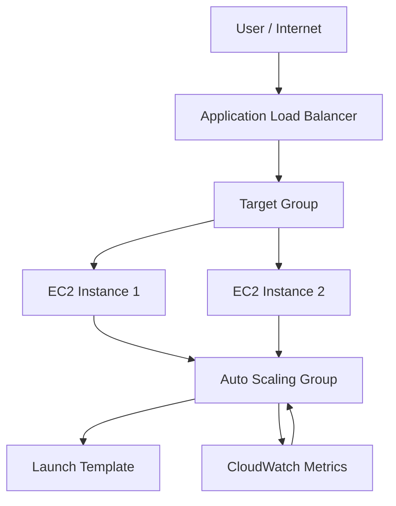

# 🚀 AWS Load Balancer & Auto Scaling Group | High Availability on AWS

A portfolio-ready AWS project demonstrating how to build a resilient, self-healing web application using EC2, Application Load Balancer, Target Groups, Launch Templates, and Auto Scaling Groups.

[](https://aws.amazon.com/)
[](https://aws.amazon.com/ec2/)
[](https://aws.amazon.com/elasticloadbalancing/)
[](https://aws.amazon.com/autoscaling/)
[](https://aws.amazon.com/cloudwatch/)
[](LICENSE)

---

## 📚 Table of Contents

- [🚀 AWS Load Balancer \& Auto Scaling Group | High Availability on AWS](#-aws-load-balancer--auto-scaling-group--high-availability-on-aws)
  - [📚 Table of Contents](#-table-of-contents)
  - [🎯 Project Overview](#-project-overview)
  - [❗ Problem Statement](#-problem-statement)
  - [✅ Solution Overview](#-solution-overview)
  - [🏗️ Architecture Diagram](#️-architecture-diagram)
    - [ASCII Diagram](#ascii-diagram)
    - [Mermaid Diagram](#mermaid-diagram)
  - [☁️ AWS Services Used](#️-aws-services-used)
  - [⭐ Key Features](#-key-features)
  - [🧩 Architecture Components](#-architecture-components)
  - [🔄 Project Workflow](#-project-workflow)
  - [🚀 Deployment Steps](#-deployment-steps)
  - [📁 Project Structure](#-project-structure)
  - [🧪 Testing \& Validation](#-testing--validation)
    - [1. Load Balancer Test](#1-load-balancer-test)
    - [2. Target Group Health Check](#2-target-group-health-check)
    - [3. Auto Scaling Test](#3-auto-scaling-test)
    - [4. Instance Recovery Test](#4-instance-recovery-test)
  - [📸 Screenshots](#-screenshots)
  - [⚙️ Challenges \& Solutions](#️-challenges--solutions)
  - [🎓 Learning Outcomes](#-learning-outcomes)
  - [🔮 Future Enhancements](#-future-enhancements)
  - [📝 Resume Project Summary](#-resume-project-summary)
  - [👨‍💻 Author](#-author)
  - [📄 License](#-license)

---

## 🎯 Project Overview

This project showcases a high-availability AWS architecture designed to improve reliability, scalability, and fault tolerance for a web application. The solution uses EC2 instances behind an Application Load Balancer, with health checks and Auto Scaling to support dynamic traffic demands.

It is well-suited for resumes, technical interviews, and cloud architecture discussions because it demonstrates practical understanding of modern AWS design patterns.

> [!NOTE]
> This project is designed as a portfolio-ready AWS implementation and documentation set. Any live AWS values shown in examples should be verified in your own environment.

---

## ❗ Problem Statement

A single EC2 instance can become a single point of failure. Without load balancing, health checks, and scaling, an application may become unavailable during traffic spikes, instance failures, or maintenance events.

This project addresses those risks by designing a system that can:
- distribute traffic efficiently,
- detect unhealthy instances,
- replace failed nodes automatically,
- and scale capacity based on utilization.

---

## ✅ Solution Overview

The solution uses an AWS-native architecture that combines:
- EC2 for application hosting,
- an Application Load Balancer for traffic distribution,
- Target Groups for health-based routing,
- Launch Templates for standardized instance provisioning,
- and Auto Scaling Groups for dynamic capacity management.

This creates a self-healing and scalable environment suitable for production-style workloads.

---

## 🏗️ Architecture Diagram

### ASCII Diagram

```text
Internet
   │
   ▼
Application Load Balancer
   │
   ├─ Health Checks
   └─ Target Group
         │
         ├─ EC2 Instance 1
         ├─ EC2 Instance 2
         └─ EC2 Instance N (if scaled out)
               │
               ▼
         Auto Scaling Group
               │
               ▼
         Launch Template
               │
               ▼
         CloudWatch Monitoring
```

### Mermaid Diagram



---

## ☁️ AWS Services Used

| AWS Service | Purpose |
|---|---|
| EC2 | Hosts the web application on virtual servers |
| Application Load Balancer | Distributes incoming traffic across healthy instances |
| Target Groups | Defines health checks and routing targets |
| Auto Scaling Group | Automatically scales capacity based on demand |
| CloudWatch | Monitors CPU and supports scaling decisions |
| VPC | Provides isolated network infrastructure |
| Security Groups | Controls inbound and outbound access |

---

## ⭐ Key Features

- High availability through distributed architecture
- Health checks for automatic failure detection
- Auto scaling based on CPU utilization
- Multi-AZ deployment readiness
- Load balancing for improved reliability
- Standardized provisioning with Launch Templates
- Clear documentation for deployment and troubleshooting

---

## 🧩 Architecture Components

<details>
<summary>View components</summary>

- EC2 Instances: Run the web application
- Application Load Balancer: Front door for traffic
- Target Group: Maintains routing and health status
- Launch Template: Defines instance configuration
- Auto Scaling Group: Manages scaling events
- CloudWatch: Monitors performance and triggers scaling decisions
- Security Groups: Restrict network access securely

</details>

---

## 🔄 Project Workflow

1. Users send requests to the Application Load Balancer.
2. The ALB forwards traffic to healthy targets in the Target Group.
3. EC2 instances serve the application.
4. CloudWatch monitors CPU usage.
5. Auto Scaling adjusts capacity based on defined policies.
6. Healthy instances continue serving traffic while unhealthy ones are replaced.

---

## 🚀 Deployment Steps

<details>
<summary>Deployment overview</summary>

1. Create a VPC and public subnets.
2. Configure security groups to allow web traffic.
3. Launch EC2 instances using a Launch Template.
4. Create an Application Load Balancer and Target Group.
5. Register EC2 instances with the Target Group.
6. Configure Auto Scaling and CloudWatch-based scaling policies.
7. Validate health checks and application availability.

</details>

Example CLI validation commands:

```bash
aws autoscaling describe-auto-scaling-groups --auto-scaling-group-names Apache-ASG
aws elbv2 describe-target-health --target-group-arn <target-group-arn>
aws cloudwatch get-metric-statistics --namespace AWS/EC2 --metric-name CPUUtilization
```

> [!TIP]
> Replace example resource names and ARNs with values from your own AWS account.

---

## 📁 Project Structure

```text
.
├── README.md
├── deployment-guide.md
├── architecture.md
├── ARCHITECTURE_ALIGNMENT.md
├── troubleshooting.md
├── VISUAL_ARCHITECTURE_GUIDE.md
├── userdata.sh
├── Images/
└── architecture images/
```

---

## 🧪 Testing & Validation

### 1. Load Balancer Test
- Verify the ALB responds to HTTP requests.
- Confirm traffic is routed to healthy backend targets.

### 2. Target Group Health Check
- Check that instances are marked healthy.
- Ensure unhealthy nodes are removed from service.

### 3. Auto Scaling Test
- Simulate increased load and confirm the ASG launches additional instances.
- Validate scaling behavior against defined thresholds.

### 4. Instance Recovery Test
- Remove or terminate an unhealthy instance.
- Confirm the ASG provisions a replacement and restores capacity.

---

## 📸 Screenshots

Placeholder screenshots will be added here for portfolio presentation.

- Architecture Overview
- ALB and Target Group Configuration
- EC2 Instance Health Status
- Auto Scaling Activity History
- CloudWatch Metrics Dashboard

---

## ⚙️ Challenges & Solutions

| Challenge | Solution |
|---|---|
| Single point of failure | Used multiple EC2 instances behind a load balancer |
| Traffic spikes | Implemented Auto Scaling for dynamic capacity |
| Unhealthy instances | Enabled health checks and target-group-based routing |
| Manual scaling | Used CloudWatch-driven scaling policies |

---

## 🎓 Learning Outcomes

This project helped strengthen expertise in:
- AWS networking and compute fundamentals
- load balancing and health-based routing
- auto scaling and cloud monitoring
- fault tolerance and high-availability design
- AWS documentation and architectural communication

---

## 🔮 Future Enhancements

- Add Terraform or AWS CloudFormation for infrastructure as code
- Integrate Route 53 and HTTPS with ACM
- Add CloudWatch alarms and SNS notifications
- Improve observability with centralized logging
- Add CI/CD automation for deployment validation

---

## 📝 Resume Project Summary

Designed and implemented an AWS-based high-availability web application architecture using EC2, Application Load Balancer, Target Groups, Launch Templates, and Auto Scaling Groups. The project demonstrates expertise in load balancing, health monitoring, fault tolerance, and auto scaling for resilient cloud-native applications.

---

## 👨‍💻 Author

Mahesh Sury  
Cloud & DevOps Enthusiast | AWS Learner | Portfolio Project

---

## 📄 License

This project is licensed under the MIT License. See [LICENSE](LICENSE) for details.
